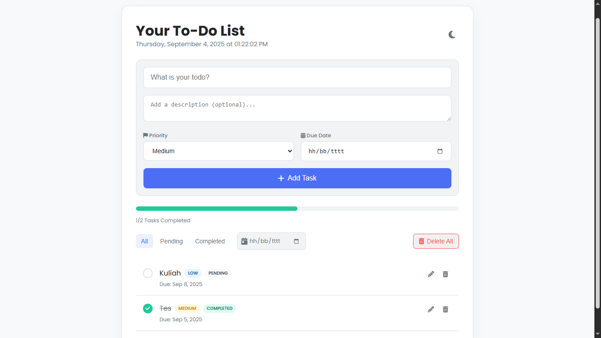
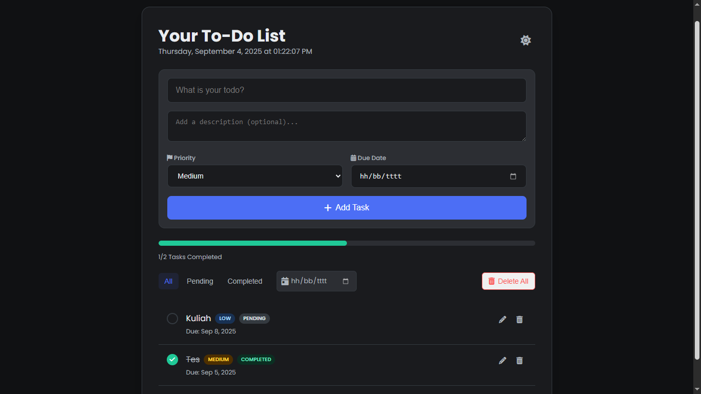

<p align="center">
  
</p>
<h1 align="center">📝 Your To-Do List</h1>

Selamat datang di repositori **Your To-Do List**, sebuah aplikasi web *single-page* yang dinamis dan interaktif untuk mengelola tugas harian. Proyek ini dirancang untuk mendemonstrasikan fundamental pengembangan web front-end modern, dengan fokus pada manipulasi DOM, manajemen *state* menggunakan Local Storage, dan desain yang responsif.

Proyek ini dibuat sebagai bagian dari tugas **Mini Coding Project** untuk program **Software Engineering Coding Camp** pada **1 September 2025** yang diselenggarakan oleh **RevoU**.

#### Tampilan Mode Terang (Light Mode)

#### Tampilan Mode Gelap (Dark Mode)



## ✨ Fitur-fitur

-   **Manajemen Tugas Penuh (CRUD):** Tambah, lihat, edit, dan hapus tugas dengan mudah.
-   **Penyimpanan Lokal:** Semua tugas disimpan di *Local Storage* browser, sehingga data tidak akan hilang saat halaman di-*refresh*.
-   **Desain Sepenuhnya Responsif:** Tampilan optimal di berbagai ukuran layar, dari desktop hingga mobile.
-   **Mode Ganda (Light & Dark):** Dilengkapi *toggle* untuk mengubah tema antara mode terang dan gelap sesuai preferensi pengguna.
-   **Detail Tugas Komprehensif:** Setiap tugas dapat memiliki deskripsi, prioritas (High, Medium, Low), dan tanggal jatuh tempo.
-   **Fitur Filter & Pencarian:**
    -   Filter tugas berdasarkan status (Semua, Tertunda, Selesai).
    -   Filter tugas berdasarkan tanggal jatuh tempo yang spesifik.
-   **Pelacakan Progres:** *Progress bar* dan penghitung visual untuk melihat kemajuan tugas yang telah diselesaikan.
-   **Modal Interaktif:** Menggunakan *pop-up* modal untuk menampilkan detail tugas, mengedit, dan konfirmasi penghapusan untuk pengalaman pengguna yang lebih baik.
-   **Indikator Visual:** Tanda visual untuk tugas yang sudah lewat jatuh tempo (*overdue*) atau jatuh tempo hari ini (*due-today*).

## 🛠️ Teknologi yang Digunakan

-   **Struktur:** HTML5
-   **Styling:** CSS3 (Termasuk Flexbox, Grid, Custom Properties untuk *theming*, dan Animasi)
-   **Logika & Interaktivitas:** JavaScript (ES6+), berfokus pada manipulasi DOM, *event listeners*, dan *Local Storage*.
-   **Library Eksternal:**
    -   **Font Awesome** untuk ikon.
    -   **Google Fonts** untuk tipografi.

Proyek ini sengaja dibangun **tanpa** menggunakan *framework* JavaScript utama seperti React atau Vue untuk memaksimalkan pemahaman dan penerapan fundamental dari teknologi web inti.

## 🚀 Cara Menjalankan Proyek

Karena ini adalah proyek web statis, tidak memerlukan instalasi yang rumit. Ikuti langkah-langkah berikut:

1.  **Clone repositori ini:**
    ```sh
    git clone https://github.com/ofikur/your-to-do-list.git
    ```

2.  **Masuk ke direktori proyek:**
    ```sh
    cd your-to-do-list
    ```

3.  **Jalankan di browser:**
    Cara termudah adalah dengan menggunakan ekstensi **Live Server** di Visual Studio Code.
    -   Klik kanan pada file `index.html`.
    -   Pilih "Open with Live Server".

    Alternatif lain adalah dengan membuka file `index.html` langsung di browser Anda.

---

## 📜 Lisensi

Proyek ini dirilis di bawah Lisensi MIT. Lihat file `LICENSE` untuk detail lebih lanjut.

---

### Terima Kasih
Terima kasih sebesar-besarnya kepada [RevoU](https://www.revou.co/id) atas ilmu dan kesempatan yang diberikan selama program Software Engineering Coding Camp.

#### ~ Ofikur R.